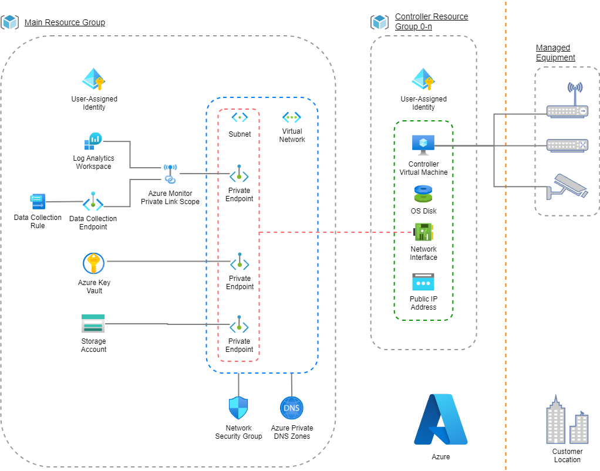

# Unifi Network Application Controller Fleet on Azure

This repo contains automation to deploy a hub resource group with central observability and other resources, plus a fleet of spoke resource groups with Unifi Network Application Controller (NAC) deployed in each spoke.

The hub resource group should be deployed first. Spoke resource groups, each with a VM running NAC, can be deployed in any order and additively over time.

## Scenario

The scenario realized by this repo is for a managed service provider (MSP) to deploy a fleet of NAC VMs for their clients. The MSP deploys a hub resource group with central observability and other resources, and then deploys a spoke resource group (0-n) with a VM running NAC for each client. The MSP can then manage the NAC VMs for their clients from the hub resource group.

## Architecture

Key Points:
- The Controller VMs expose a public IP address. This is required for managed network equipment to communicate with the Controller VMs from customer premises.
- All internal networking uses Private Endpoints with Private Link, including the use of [Azure Monitor Private Link Scope](https://learn.microsoft.com/azure/azure-monitor/logs/private-link-security#how-it-works-main-principles) to keep Azure Monitor traffic within Azure.
- An Azure Key Vault stores all Controller VM SSH keys (public and private) as well as SSH key names and VM admin usernames.
- A Network Security Group (NSG) stores inbound rules and restricts inbound traffic. During GitHub Actions workflow execution, NSG rules are added to allow the GitHub Actions runner to access the data plane, then those NSG rules are removed again before GitHub Actions workflow completion, whether or not prior GitHub Actions workflow steps succeed.
- Each Controller deployment includes its own User-Assigned Identity. In this way, each Controller has a distinct identity, with distinct permissions, for more granular permission management and auditing. The GitHub Actions workflows manage creating the required Role-Based Access Control (RBAC) permissions during Controller deployment, and removing the permissions during Controll destruction.
- A utility function, `Get-SshKeyPairToLocalFiles()`, is provided in [./scripts/KeyVault.ps1](./scripts/KeyVault.ps1) to retrieve the SSH key pair from Key Vault and write the public and private SSH keys to local files, so that the Controller VMs can be accessed via SSH.
- Each Controller VM is configured with a Let's Encrypt TLS certificate obtained via [Certbot](https://certbot.eff.org/) with auto-renew. The TLS certificate is used to secure NAC web UI access. It is requested for the FQDN consisting of the Controller VM name derived during Controller deploy workflow, and the `DomainName` property configured in [/config/infra_controller.json](/config/infra_controller.json).
  - **NOTE**: Certbot [does not publish its list of public IP addresses used to validate TLS certificate requests from a VM](https://certbot.eff.org/faq#what-ip-addresses-will-the-let-s-encrypt-servers-use-to-validate-my-web-server). Therefore, during the Controller deploy workflow, the step where the TLS certificate is requested is preceded by a step to allow public internet access inbound to the Controller VM by adding a corresponding NSG rule. After the steps to request the TLS certificate from Certbot complete, the NSG rule is deleted, whether or not the TLS certificate request succeeds.
- NSG rules specific to each controller are added, using the `SourceAddressPrefix` specified in [./config/infra_controller.json](./config/infra_controller.json). This allows access from the customer premise(s) to the Controller VM, without opening the Controller VM to broader inbound access from the public internet. Note that if the premise public IP changes routinely, this approach may not be suitable and more general inbound access may be required for that Controller.

In general, the network architecture uses least privilege principles both for persistent Controller VM access (from customer's premises for managed network equipment traffic) and for transient access added, and then removed, during GitHub Actions workflow execution.

## GitHub Actions Workflows

The following GitHub Actions workflows are provided:

- [/.github/workflows/DeployInfra-Main.yaml](/.github/workflows/DeployInfra-Main.yaml) - Deploy the hub resource group and the central/shared resources.
- [/.github/workflows/DestroyInfra-Main.yaml](/.github/workflows/DestroyInfra-Main.yaml) - Destroys the hub resource group and the central/shared resources. Additionally, removes diagnostics settings and role-based access control (RBAC) permissions to avoid leaving orphaned resources behind that are not removed by a simple resource group delete.
- [/.github/workflows/DeployController.yaml](/.github/workflows/DeployController.yaml) - Deploys a spoke resource group with a VM running NAC. Adds all RBAC permissions, diagnostics settings, deploys the VM, and configures the VM to run NAC with a Let's Encrypt TLS certificate.   **NOTE:** This is primarily driven by [/config/infra_controller.json](/config/infra_controller.json) (see below). Until the config file is replaced by a more flexible store, such as a CRM database or similar, this config file must be prepared for the specific controller deployment by at least setting the controller `Id` and `IdForNaming` properties. 
- [/.github/workflows/DestroyController.yaml](/.github/workflows/DestroyController.yaml) - Destroys a spoke resource group with a VM running NAC. Additionally, removes diagnostics settings and RBAC permissions to avoid leaving orphaned resources behind that are not removed by a simple resource group delete.

## Variables and Configuration

The GitHub Actions workflows use both GitHub Actions Secrets and GitHub Actions Variables, as well as JSON files in the repo to configure the deployment.

### GitHub Secrets

The following GitHub Secrets are required. You should configure them in Repository Settings > Security > Secrets and variables > Actions > Secrets.

- `AZURE_CREDENTIALS`: the JSON output of `az ad sp create-for-rbac --name "[YOUR SERVICE PRINCIPAL NAME]" --role Owner --scopes /subscriptions/[YOUR SUBSCRIPTION ID] --sdk-auth`. This is used to authenticate to Azure. Substitute your service principal name for `[YOUR SERVICE PRINCIPAL NAME]` and your Azure subscription ID for `[YOUR SUBSCRIPTION ID]`.
- `AZURE_SP_AA_INFRA_PRINCIPAL_ID`: the principal ID of the service principal you created for `AZURE_CREDENTIALS`. This is used to grant the service principal access to the Key Vault so that it can read and write secrets in GitHub Actions workflow steps.
- `AZURE_SUBSCRIPTION_ID`: your Azure subscription ID. This is used widely to scope Azure CLI commands to your subscription. Specifying the subscription ID during Azure CLI and Powershell commands enables scenarions where you may be logged into multiple Azure subscriptions, with your default subscription differing from the subscription you want to target with this repo's deployments.
- `AZURE_TENANT_ID`: your Azure tenant ID. This is required to deploy Azure Key Vault and User Assigned Identities.

### GitHub Variables

The following GitHub Variables are required. You should configure them in Repository Settings > Secrets and variables > Actions > Variables.

- `URL_ROOT_MODULE_PLZM_AZURE`: the URL to the Powershell module plzm.Azure, which contains many Powershell utility functions used by the GitHub Actions workflows and scripts in this repo. This Powershell module is maintained in the repo [plzm/azure-deploy](https://github.com/plzm/azure-deploy). By default, the GitHub Actions workflows and scripts in this repo will use the latest version of the module from the main branch.

### JSON Config Files

The following JSON config files are required for GitHub Actions workflows and scripts. Hard-coding of explicit strings in the GitHub Actions workflows and scripts is avoided by using config files and the instantiated $Config* objects used throughout the GitHub Actions workflows.

- [/config/infra_constants.json](/config/infra_constants.json) - various constant values set in one place, and used across GitHub Actions workflows and scripts, to avoid duplication of hard-coded strings.
- [/config/infra_controller_ssh.json](/config/infra_controller_ssh.json) - values used only for managing NAC VM SSH access during GitHub Actions workflow execution.
- [/config/infra_controller.json](/config/infra_controller.json) - values used for NAC VM deployment. This will be replaced by a more flexible store, such as a CRM database or similar, to avoid storing client information in a public repo and to enable more flexible deployment scenarios.
- [/config/infra_main.json](/config/infra_main.json) - values used for shared/hub resource deployments.

These files can be modified as needed. Key names should be maintained (or refactored throughout all GitHub Actions workflows and scripts).
